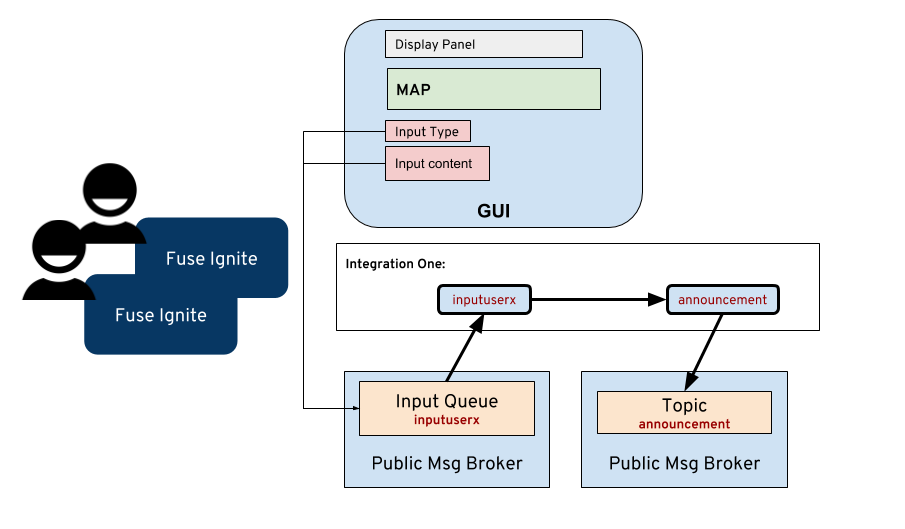
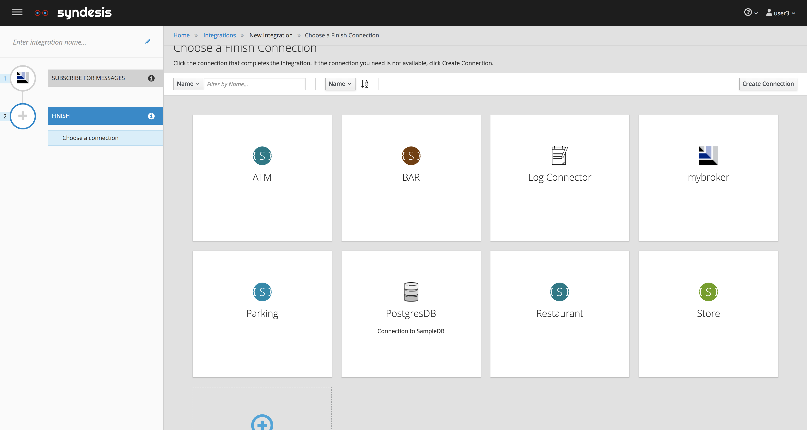
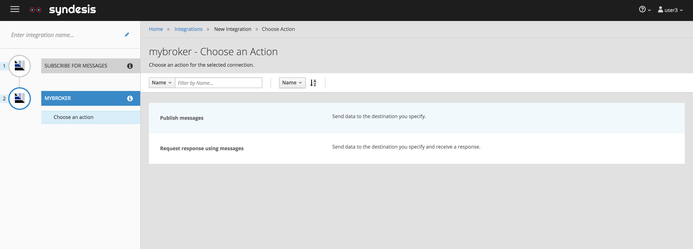
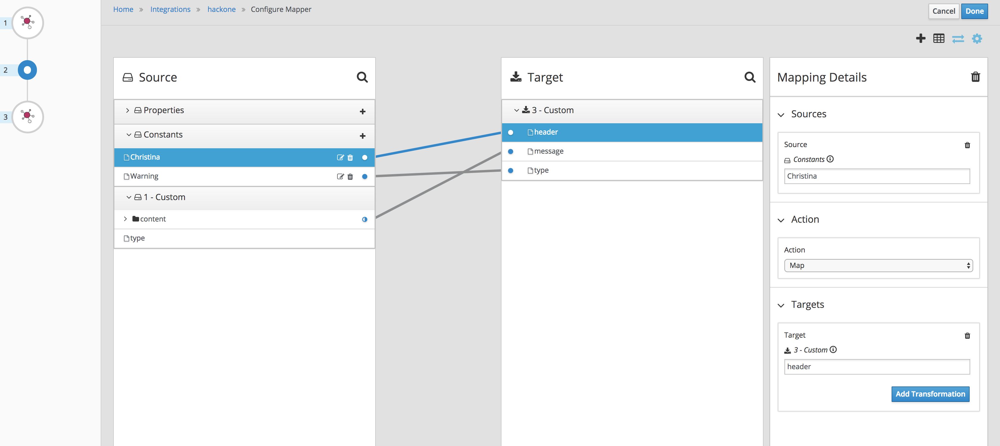
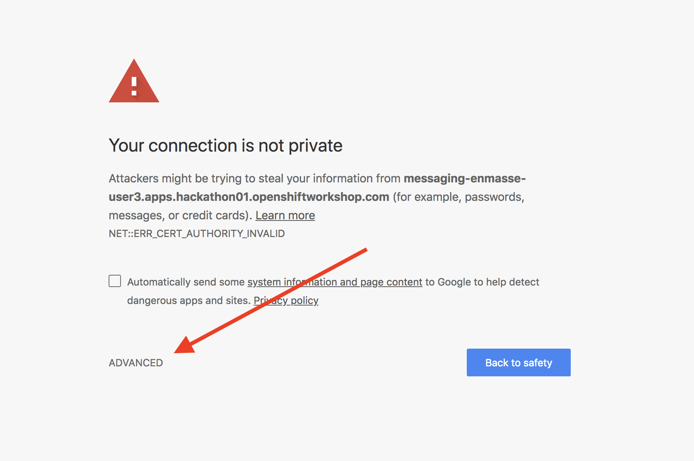
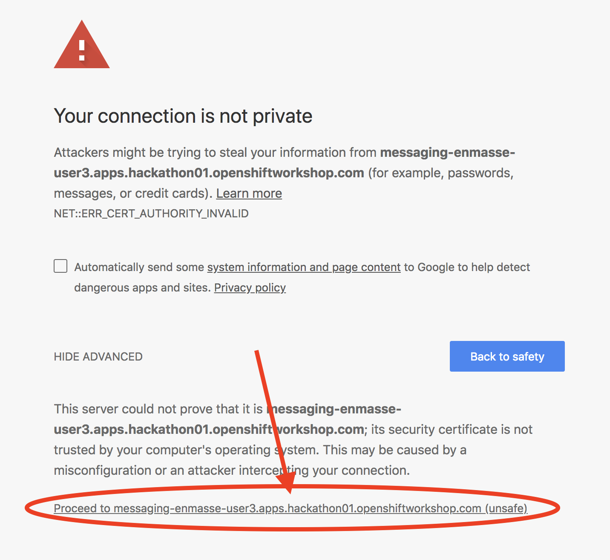
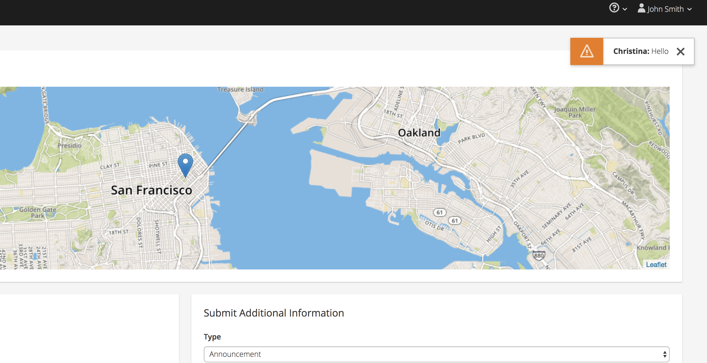

# First Hack - Data Shapes and Data Mapper
-Instructor lead-

Publishing input and receiving from announcement topic!



- Add connection for messaging broker for Input queue and announcement topic. Select the **Connections** on the side menu, and click on **Add Connection** button on the top right hand corner.

  

- Click on the AMQP Connector.

  

- Configure your AMQP settings accordingly, all the information should be avaliable in your OSE env, within the Broker's secret setting. 

   	- Connection URL : amqp://*messagingHost* 
   	- User Name: *username*
   	- Password: *password*
   	- Check Certificate: *Disable*

- And click **Next** when done. 

  
  
  

- Give a name to your broker connection, and click **create** 

  

- **Create new integration**. Select the **Integration** on the side menu, and click on **Create Integration** in the center.

  

- Select < YOUR_BROKER_CONNECTION > .

  

- Select *subscribe for messages action*. 

  

- Configure the name of the queue to listen
	- Destination Name: inputs
	- Destination Type: Queue 

  

- Configure the Output data type,  
  	- Select Type: JSON Instance
	- Definition: 
		```
		{
		"type": "announcement",
		"content": {
			"title": "Tester",
			"text": "This is the message for everyone!!"
			}
		}
		```
  

- For end connector setting, and select the <YOUR_BROKER_CONNECTION>   

  

- Select *Publish messages action*. 

  

- Configure the name of the queue to listen
	- Destination Name: notifications
	- Destination Type: Topic 

  

- Configure the Output data type,  
  	- Select Type: JSON Instance
	- Definition: 
	
		```
		{
		"type": "Success",
		"header": "Christina",
		"message": "This is the message for <strong>everyone</strong>!!"
		}
		```	

  

- Select *Add a Step* in the center

  

- Select *Data Mapper* in action

  

- Add two contant by clicking in the Source column **"+"** of *Constants* drop down menu. 
	- \<YOUR_NAME\>
	- Warning 

  

- Drag and connect from Source to Target and click in **Done**
	- Custom -> Content -> text **to** message
	- Custom -> Content -> title  **to** header
	- Constants -> Warning **to** type 

  

- Give a name to integration and click in **Finish**

  
  
	### IMPORTANT

	Accept the self-signed certificates before using the UI or it won't be able to connect to the backend services. In a browser tab go to the following url. Replace *X* with your actual user number.

	```
	https://messaging-enmasse-userX.apps.hackathon.openshiftworkshop.com 
	```

	Accept the certificate validation by clicking on **ADVANCED**

	
	
	Then clicking on **Proceed to messaging-enmasse-userX.apps.hackathon.openshiftworkshop.com (unsafe)**
	
	
	
	The page will keep on *Waiting for messaging-enmasse-userX.apps.hackathon.openshiftworkshop.com* to load. That's fine it means you are connected to the backend service, but as we are not sending anything back it will stuck like that. You can now close this tab and continue with the rest of the procedure.

- Go to your UI, *http://www-hackathon-ui-\<USER_NAME\>.apps.hackathon.openshiftworkshop.com/*, in the input panel, 
	- Type: Annoucement
	- Title: \<YOUR_NAME\>
	- Text: Hello

  

- You should see a small alert pop up on the top righthand corner.

  