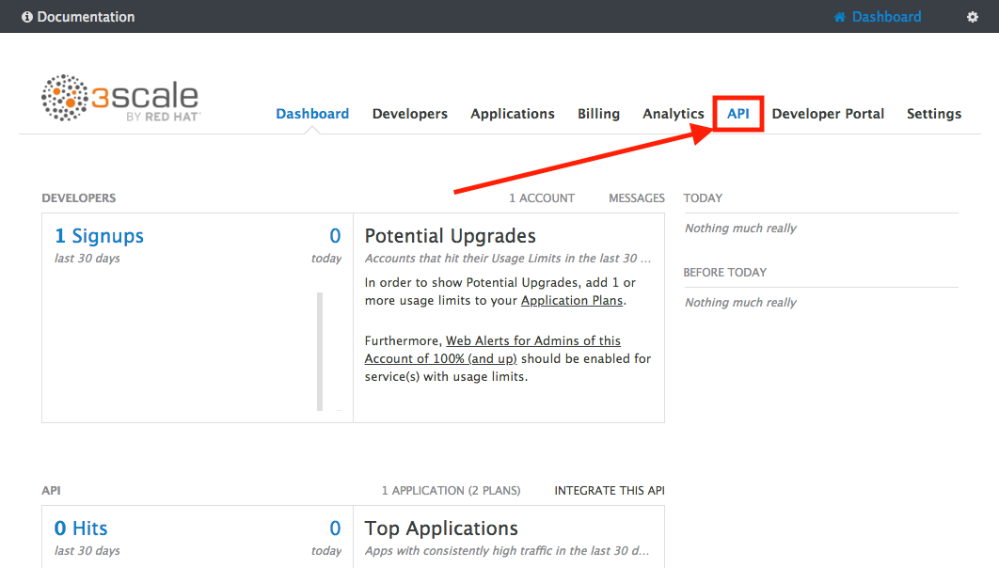
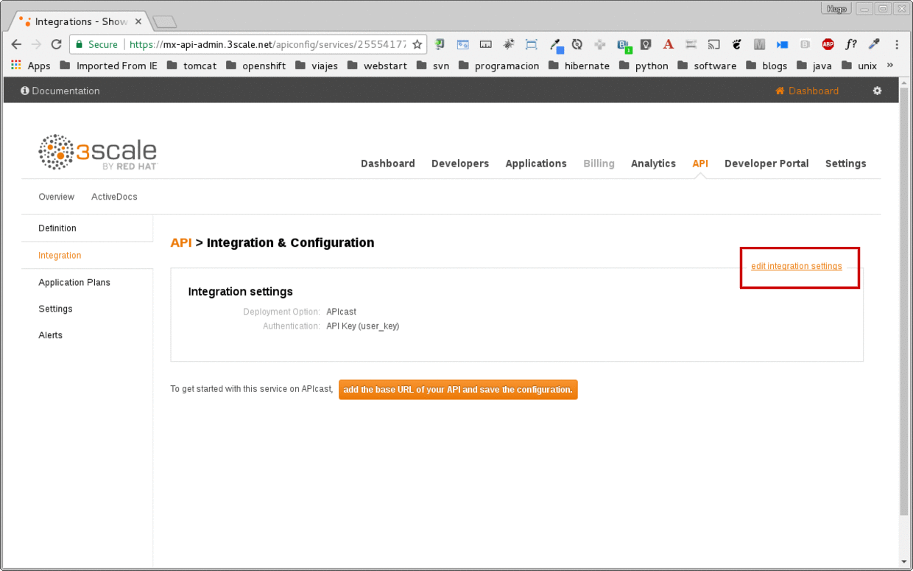
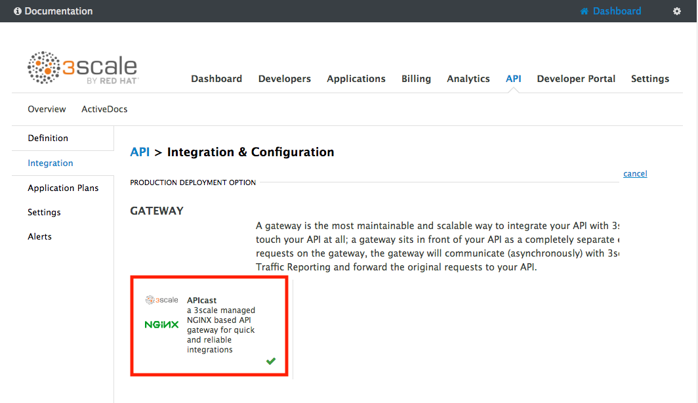
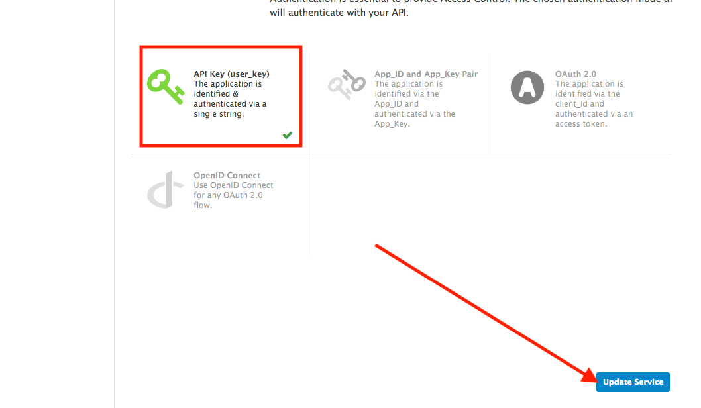
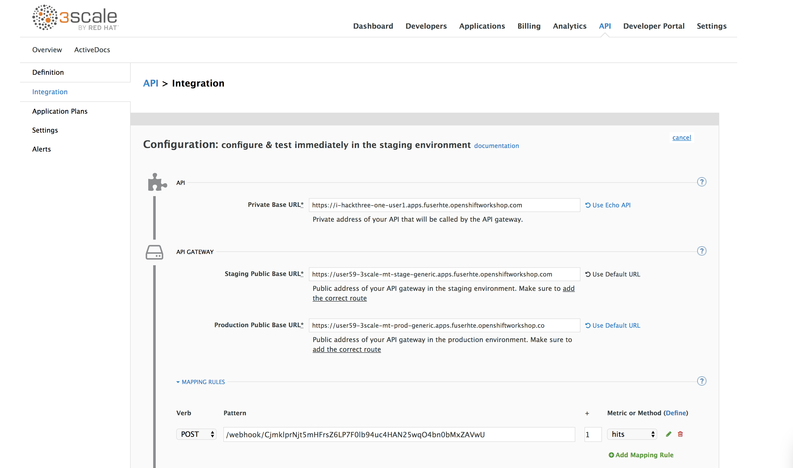
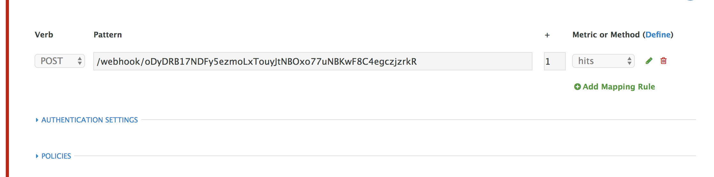
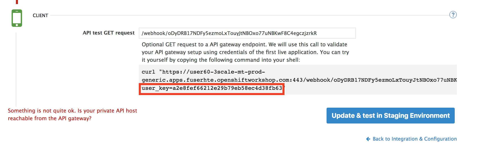
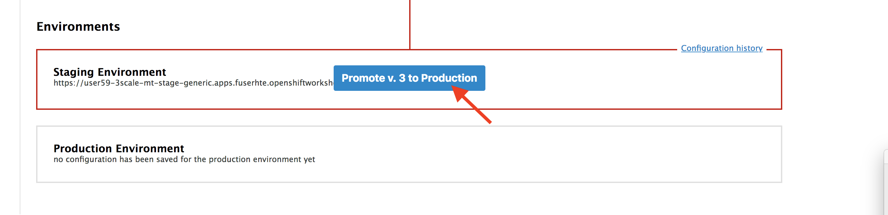

# Fourth Hack

-Instructor lead-

Managing your API 


- Login into your 3scale by going to the following URL and replace the **X** with your user number. and login with your openshift credential.

	- username: userX
	- password: openshift

```
https://userX-3scale-mt-admin.apps.fuserhte.openshiftworkshop.com/
```
 
### Step 1: Define your API Proxy

- Accept the self-signed certificate if you haven't.

    


- The first page you will land is the *API Management Dashboard*. Click on the **API** menu link.

    

- This is the *API Overview* page. Here you can take an overview of all your services. Click on the **Integration** link.

    

- Click on the **edit integration settings** to edit the API settings for the gateway.

    

- Keep select the **APIcast** deployment option in the *Gateway* section.

    

- Scroll down and keep the **API Key (user_key)** Authentication.

    

- Click on **Update Service**.

- Click on the **add the Base URL of your API and save the configuration** button.
Scroll down and expand the **MAPPING RULES** section to define the allowed methods on our exposed API.

```
Private Base URL*
https://i-YOUR_HACKTHREE_ID.apps.fuserhte.openshiftworkshop.com:443

Staging Public Base URL*
https://userX-3scale-mt-stage-generic.apps.fuserhte.openshiftworkshop.com:443

Production Public Base URL*
https://userX-3scale-mt-prod-generic.apps.fuserhte.openshiftworkshop.com:443

```
- Click on the **Add mapping rule** link
- Click on the edit icon next to the POST mapping rule.




- Type in the *Pattern* text box the following: 

    ```bash
    /webhook/<YOUR WEBHOOK CONTENT ROUTE>
    ```


- Also under Client -> API test GET request also enter 

	```bash
    /webhook/<YOUR WEBHOOK CONTENT ROUTE>
	```
- Click on the *Update & test in Staging Environment*. It is ok if it returns 404 error. Note the user_key in the generated command.



- Go back to the previous page and click promote. 



And you are ready to have the API managed by 3scale. Try testing it by running it with and without the user key 

```bash
curl -k -H 'Content-Type: application/json' -d '{ "level": "Warning: "Tester", "msg": "This is the message from API!!!!!"}}' https://userX-3scale-mt-stage-generic.apps.fuserhte.openshiftworkshop.com/webhook/<YOUR WEBHOOK CONTENT ROUTE>?user_key=<YOUR USER ROUTE>
```