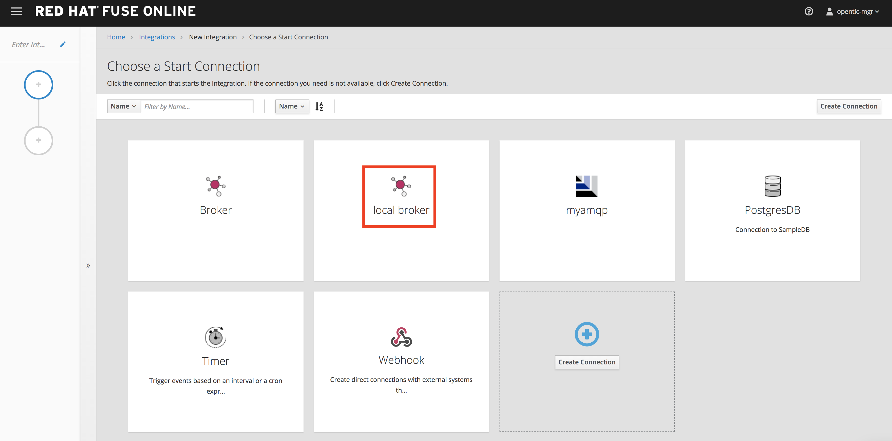
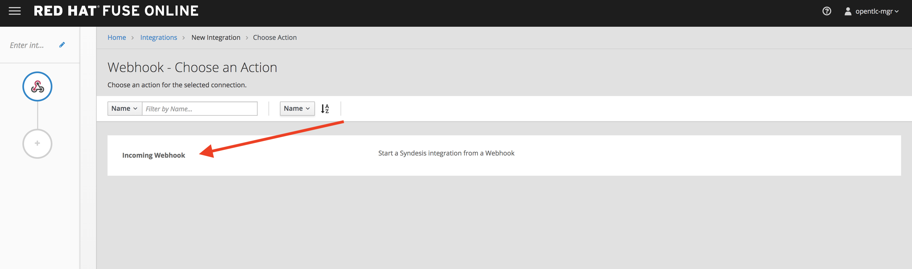
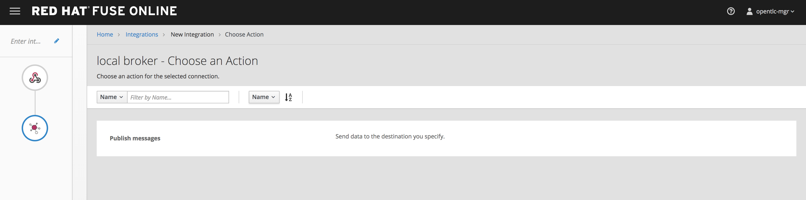
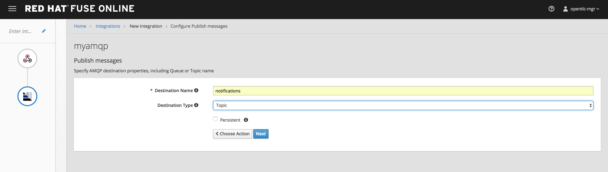

# Fourth Hack

-Instructor lead-

Managing your API 


- Login into your 3scale by going to the following URL and replace the **X** with your user number. and login with your openshift credential.

	- username: userX
	- password: openshift

```
https://userX-3scale-mt-admin.apps.fuserhte.openshiftworkshop.com/
```
 

- Click on the API on the top right.
- And click on **+Create Service** also on the top right under API.
- Give any name to your new API service.
- Leave everything as default, and click on the **Create Service** button at the bottom of the page.


- Expand the newly create *notification API service*, and click on **Integration** underneath the titile.
- Click on *add the base URL of your API and save the configuration.*
- Copy the URL from your previous hack (Third hack) and place it in *Private Base URL* and click on *Update & test in Staging Environment* button.


 
- Configure your AMQ Message Broker settings accordingly, all the information should be avaliable in your OSE env, within the Broker's secret setting. 

   	- Connection *URL : tcp://broker-amq-tcp:61616*
   	- User Name: *amq*
   	- Password: *topSecret*
   	- Check Certificate: *Disable*

- And click **Next** when done. 

- Give any name to your broker connection, and click **create** 


- **Create new integration**. Select the **Integration** on the side menu, and click **Create Integration** button on the top right hand corner.


- Click on the WebHook Connector.

  

- Select *Incoming Webhook* .

  

- Click on Next. 


- Configure the Output data type,
  - Select Type: JSON Instance
  - Definition:
    ```
    {
      "level": "Warning",
      "content": {
        "title": "Tester",
        "msg": "This is the message for everyone!!"
      }
    }
    ```
  
- For end connector setting, and select the  < YOUR_AMQ_MESSAGING_BROKER_CONNECTION >   

- Select *Publish messages action*. 

  

- Configure the name of the queue to listen
	- Destination Name: notifications
	- Destination Type: Topic 
	- Disable persisttent

  

- Configure the Output data type,  
  	- Select Type: JSON Instance
	- Definition: 
	
     ```
    {
      "level": "Warning",
      "content": {
        "title": "Tester",
        "msg": "This is the message for everyone!!"
      }
    } 
	```
- Click **DONE** and then **Publsih**

- Give a name to the route and click **Finish**
- Wait for integration to finish deployment. Once the the integration is fully deployed, you will find an API automatically appear, copy it. *(You can come back to this integration after you are done with the next one.)*

  
- **Create new integration**. Select the **Integrations** on the side menu, and click on **Create Integration** in the center.


- Select < YOUR_AMQ_MESSAGING_BROKER_CONNECTION > .

  

- Select *subscribe for messages action*. 

  

- Configure the name of the queue to listen and click *Next*
	- Destination Name: notifications
	- Destination Type: Topic 


- Configure the Output data type,  
  	- Select Type: JSON Instance
	- Definition: 
		```
		{
      "level": "Warning",
      "content": {
        "title": "Tester",
        "msg": "This is the message for everyone!!"
      }
    }
		```
  

- For end connector setting, and select the  < YOUR_BROKER_CONNECTION >  (**AMQP**) 

- Select *Publish messages action*. 

- Configure the name of the queue to listen
	- Destination Name: notifications
	- Destination Type: Topic 
	- Disable persisttent

  

- Configure the Output data type,  
  	- Select Type: JSON Instance
	- Definition: 
	
		```
		{
		"type": "Success",
		"header": "Christina",
		"message": "This is the message for <strong>everyone</strong>!!"
		}
		```	

- On the integration route menu, hover over the **+** sign between first and last connection, click on **Add a Step**


- Select **Data Mapper** Step


- Map from Source ->  to Target -> Custom 
	- content -> msg **to**  message
	- content -> title **to**  header
	- content -> level **to**  type

- Click **DONE** and then **Publsih**

- Give a name to the route and click **Finish**


- Open your terminal window, try entering the follow command to call the API you just established.

```
curl -k -H 'Content-Type: application/json' -d '{ "level": "Warning", "content": { "title": "API Tester", "msg": "This is the message coming from API!!!!"}}' <YOUR_API_EXTERNAL_URL>
```
 
- Go to your UI, http://www-hackathon-ui-<USER_NAME>.apps.fuserhte.openshiftworkshop.com, and a notification should appear!


- Try a couple of more calls, and you have an **API** exposed using **Fuse Online**!