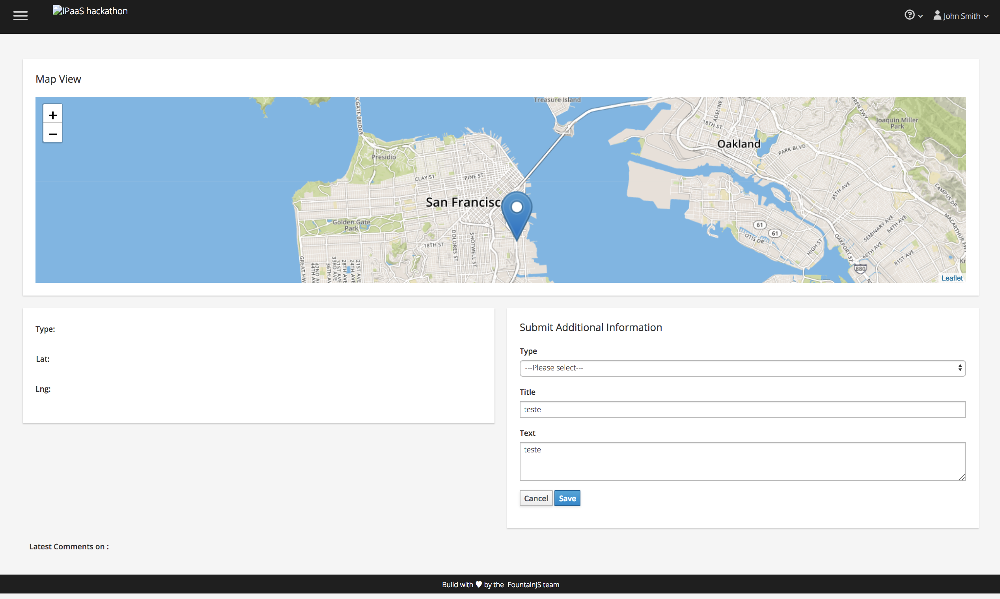

## Deploying Web Application

You can now deploy the Hackathon UI Web Application. It will become the point of interface with the backend integrations through the addresses you define in the previous step. 

### IMPORTANT

Accept the self-signed certificates before using the UI or it won't be able to connect to the backend services. In a browser tab go to the following url. Replace *X* with your actual user number.

```
https://console-enmasse-userX.apps.fuserhte.openshiftworkshop.com 
```

Accept the certificate validation by clicking on **ADVANCED**


Then clicking on **Proceed to messaging-enmasse-userX.apps.hackathon.openshiftworkshop.com (unsafe)**


The page will keep on *Waiting for https://console-enmasse-userX.apps.fuserhte.openshiftworkshop.com* to load. That's fine it means you are connected to the backend service, but as we are not sending anything back it will stuck like that. You can now close this tab and continue with the rest of the procedure.

To deploy the application complete the following steps:

1. In the OpenShift Service Catalog overview, select **Hackathon Web Application**.

    

1. Click on **Next >**.

    

1. Fill in the connection configuration to the messaging environment. You collected the information in the last step of the previous section: _Create Application Credentials_.Then click on **Next >**.

**IMPORTANT!!! MAKE SURE YOU ENTER THE USERNAME/PASSWORD CORRECTLY!!!!**
    

 Scroll down and fill in the addresses names.

 

1. In the next screen select **Do not bind at this time**. Click on **Create**.

    

1. In the final step of the wizard click on the **Continue to the project overview** link,

    

**OPTIONAL!!!!!!!!** If you prefer to use the OpenShift CLI issue the following command:

```
$ oc new-app hackaton-ui -p AMQ_SERVER=<REPLACE-WITH-YOUR-SERVER> -p AMQ_USERNAME=<REPLACE-WITH-USERNAME> -p AMQ_PASSWORD=<REPLACE-WITH-PASSWORD>
```

You will get a text output like the following:

```
--> Deploying template "openshift/hackathon-ui" to project user2

     Hackathon Web Application
     ---------
     Application template for the Web Application

     * With parameters:
        * AMQ_SERVER=localhost
        * AMQ_PORT=443
        * AMQ_USERNAME=amqp
        * AMQ_PASSWORD=password
        * AMQ_LOCATIONS=locations
        * AMQ_INPUTS=inputs
        * AMQ_NOTIFICATIONS=notifications
        * GITHUB_TRIGGER_SECRET=xCkxVQ2G # generated
        * GENERIC_TRIGGER_SECRET=oQiyBcVU # generated

--> Creating resources ...
    buildconfig "hackathon-ui" created
    imagestream "hackathon-ui" created
    deploymentconfig "hackathon-ui" created
    configmap "amq-config" created
    service "hackathon-ui-http" created
    route "www-hackathon-ui" created
--> Success
    Build scheduled, use 'oc logs -f bc/hackathon-ui' to track its progress.
    Access your application via route 'www-hackathon-ui-user2.apps.a3fa.openshift.opentlc.com' 
    Run 'oc status' to view your app.
```

It will take a few minutes for the server to provision.


The build will start automatically. It will take a while to setup the build and deploy the application. Please wait for the pod to be up and running (dark blue circle, "Running" label should display when you put the mouse over the circle). *It may take up to 5 minutes to complete this step*.


After the build is over and the application has been deployed you can click on the application URL to access the UI.


You will then see the web application UI.



If you see the above application you've done with this step. Go back to the main instructions and keep with the next step.

**End of Section**
